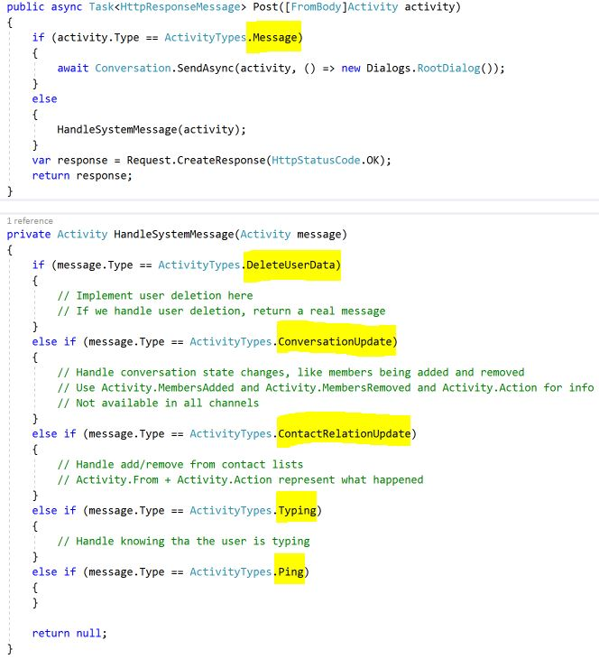
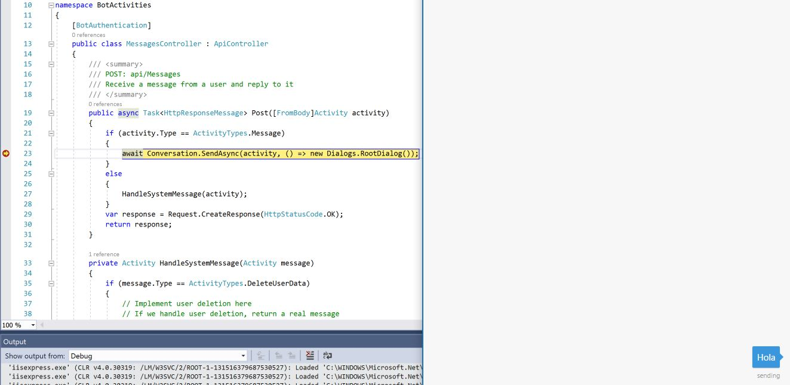
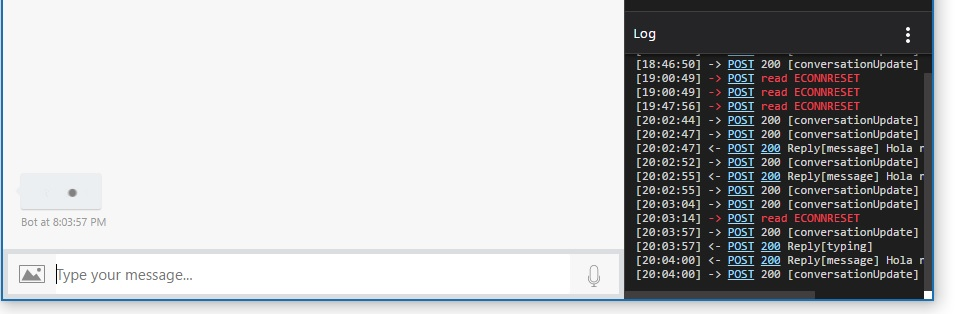

# ¿Qué es una actividad?

El conector de un bot en el SDK de este framework basa toda su actividad en **actividades**, estas actividades tienen la capacidad de intercambiar información entre el bot y un canal establecido (Skype, Telegram, Teams, etc.). Cualquier tipo de comunicación entre ambos elementos es una actividad de algún tipo. Algunas actividades son invisibles al usuario, por ejemplo el establecimiento de la conexión entre el canal y la actividad.

## Tipos de actividades

| Tipo | Descripción |
| ----- | ---------- |
| message | Representa cualquier nota entre el bot y el usuario |
| conversationUpdate | Indica que el bot fue agregado, eliminado o que los metadatos fueron modificados |
| contactRelationUpdate | Indica que el bot fue agregado o eliminado de una lista de contactos |
| typing | Indica que el usuario o el bot están creando una respuesta |
| ping | Representa un intento para ver que el punto de acceso del bot es accesible |
| deleteUserData | Indica que se le ha pedido al bot eliminar cualquier tipo de información |
| endOfConversation | Indica el final de una conversación |
| event | Representa un tipo de comunicación enviada al bot que no es visible para el usuario |
| invoke | Representa un tipo de comunicación para realizar cierta operación. **Este tipo de actividad es reservado para uso interno del SDK** |

## Actividades en el proyecto base 

Al crear un nuevo proyecto podrás encontrar al iniciar que se despliegan varios tipos de actividades y únicamente las de tipo message son manejadas de diferente manera.



El método *HandleSystemMessage* es el encargado de trabajar con todos los tipos de actividades que podríamos utilizar. Comencemos por ver que sucede al establecer comunicación desde el emulador. 

Coloca un punto de interrupción, ejecuta tu proyecto y establece la comunicación con tu emulador. Podrás ver lo siguiente.


El tipo de actividad en este caso es **ConversationUpdate**, de acuerdo a la tabla anterior podrás saber que es el indicativo de que alguien acaba de agregar al bot para conversar con el, en este tipo de eventos podría ser una gran idea desencadenar un proceso que te notifique que alguien lo tiene agregado en su lista de contactos o simplemente guardar un registro. Si creas una respuesta para mencionarle a tu usuario que ya todo está listo para comenzar a trabajar pondrías algo como esto.

``` csharp - C
if (message.Type == ActivityTypes.ConversationUpdate)
{
    ConnectorClient connector = new ConnectorClient(new Uri(message.ServiceUrl));
    Activity reply = message.CreateReply("Conexión establecida");
    connector.Conversations.ReplyToActivityAsync(reply);
}
``` 

Algo interesante en el caso del emulador es que al hacer esto recibirás una respuesta doble.


Esto sucede simplemente porque esta actividad se ejecuta en primer lugar cuando alguien agrega al bot a su lista y en segundo lugar porque el usuario se unió a la conversación, ambos eventos están relacionados en la misma actividad por lo que el mensaje se escribirá naturalmente dos veces, considera que hay una interfaz que trabaja con este tipo de actividad, la interfaz **IConversationUpdateAsync**, con esta interfaz podremos apoyarnos para establecer en qué caso queremos escribir un mensaje y en cuales no.

``` csharp - C
else if (message.Type == ActivityTypes.ConversationUpdate)
{
    IConversationUpdateActivity updatedStatus = message;
    ConnectorClient connector = new ConnectorClient(new Uri(message.ServiceUrl));
    if (updatedStatus.MembersAdded != null && updatedStatus.MembersAdded.Any())
    {
        foreach (var item in updatedStatus.MembersAdded)
        {
            if (item.Id != message.Recipient.Id)
            {
                Activity reply = message.CreateReply("Hola nuevo usuario, bienvenido!");
                connector.Conversations.ReplyToActivityAsync(reply);
            }   
        }  
    }
    
}
```
Nota que en ambos casos **message** es una clase de tipo Activity y creamos un nuevo objeto del mismo tipo para ahora responder al usuario.  
El siguiente paso es escribir un texto y verás ahora que el tipo de actividad es **Message**, aquí no hay ninguna sorpresa.



##¿En qué casos utilizaría los otros tipos de actividad?

Es sencillo, la actividad **Ping** es utilizada por el Bot Connector para asegurar la comunicación así que es casi seguro que tú no la uses a menos de que quieras verificar que todo vaya bien con tu bot.

La actividad **Typing** es muy buena para hacerle notar a tu usuario que tu bot está escribiendo, solo basta agregar un par de líneas al código anterior.

``` csharp - C
 if (item.Id != message.Recipient.Id)
{
    Activity isTyping = message.CreateReply();
    isTyping.Type = ActivityTypes.Typing;
    connector.Conversations.ReplyToActivityAsync(isTyping);
    Thread.Sleep(3000);
    Activity reply = message.CreateReply("Hola nuevo usuario, bienvenido!");
    connector.Conversations.ReplyToActivityAsync(reply);
}   
```

El resultado en tu emulador lucirá de la siguiente manera por los tres segundos que fijamos para alcanzar a ver esta acción.



La actividad de manejo de información **DeleteUserData** la utilizaremos en los artículos donde manejamos información porque será mucho más útil allá, ahora es complicado simular el escenario.

En cuando a la actividad de **Message**, asumiendo que se trata de la más utilizada la revisaremos en el siguiente ejercicio. ¡Allá nos vemos!


