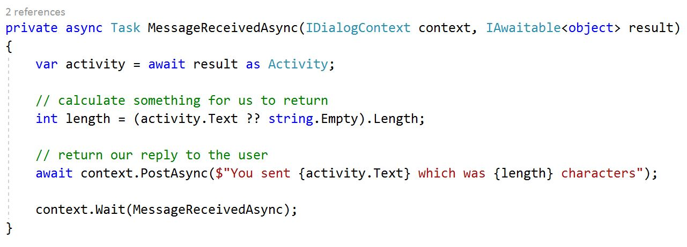
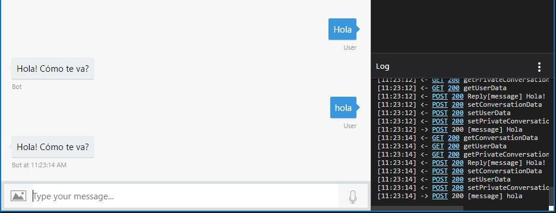
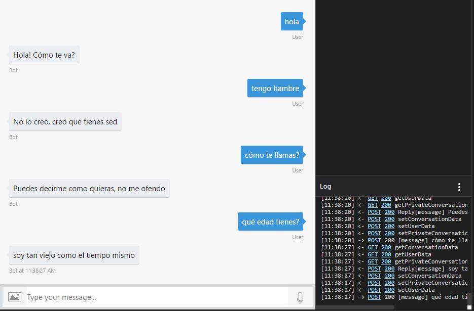

# Formulario básico de preguntas y respuestas

Bueno, suficiente de teoría, concepto y todo, es en este tema en donde al fin habrá mucho código por desplegar así que vayamos directo al punto.

Comienza por crear un proyecto de tipo bot y colócate en la clase RootDialog para poder ver algo como esta imagen.



Establece un *if* para asociar un mensaje específico con el mensaje que tu usuario va a ingresar.

``` csharp - C
private async Task MessageReceivedAsync(IDialogContext context, IAwaitable<object> result)
{
    var activity = await result as Activity;

    if (activity.Text == "Hola")
    {
        await context.PostAsync("Hola! Cómo te va?");
    }
    else
    {
        await context.PostAsync("Lo siento, no entiendo esta pregunta");
    }

    context.Wait(MessageReceivedAsync);
}
```

Con este código ya estableciste tu primer diálogo al saludar pero hay algunos detalles como el insignificante hecho de que si escribes *hola* en minúsculas entonces el bot no lo entenderá así que antes de continuar es muy buena idea trabajar de manera interna con todo en minúsculas.
``` csharp - C
 private async Task MessageReceivedAsync(IDialogContext context, IAwaitable<object> result)
{
    var activity = await result as Activity;
    string receivedString = activity.Text.ToLower();

    if (receivedString == "hola")
    {
        await context.PostAsync("Hola! Cómo te va?");
    }
    else
    {
        await context.PostAsync("Lo siento, no entiendo esta pregunta");
    }

    context.Wait(MessageReceivedAsync);
}
```

El resultado en tu emulador lucirá así:



Ahora cambia la sentencia *if* por un *switch* para que puedas poner una mayor variedad de comentarios.
``` csharp - C
private async Task MessageReceivedAsync(IDialogContext context, IAwaitable<object> result)
{
    var activity = await result as Activity;
    string receivedString = activity.Text.ToLower();

    switch (receivedString)
    {
        case "hola":
            await context.PostAsync("Hola! Cómo te va?");
            break;
        case "tengo hambre":
            await context.PostAsync("No lo creo, creo que tienes sed");
            break;
        case "cómo te llamas?":
            await context.PostAsync("Puedes decirme como quieras, no me ofendo");
            break;
        case "qué edad tienes?":
            await context.PostAsync("soy tan viejo como el tiempo mismo");
            break;
        default:
            await context.PostAsync("Lo siento, no entiendo esta pregunta");
            break;
    }

    context.Wait(MessageReceivedAsync);
}
```
Todas estas respuestas las podrás ver en tu emulador fácilmente de la siguiente manera.



Comienza a lucir bastante bien ¿no? Desde aquí podrás comenzar a jugar y mejor aún, establecer un buen flujo de conversación pero antes de continuar, podrías refinar un poco lo que haces aquí y puedes comenzar por eliminar el método *PostAsync* para colocarlo hasta el final y solo reciba una cadena.
``` csharp - C
private async Task MessageReceivedAsync(IDialogContext context, IAwaitable<object> result)
{
    var activity = await result as Activity;
    string receivedString = activity.Text.ToLower();
    string reply = string.Empty;

    switch (receivedString)
    {
        case "hola":
            reply = "Hola! Cómo te va?";
            break;
        case "tengo hambre":
            reply = "No lo creo, creo que tienes sed";
            break;
        case "cómo te llamas?":
            reply = "Puedes decirme como quieras, no me ofendo";
            break;
        case "qué edad tienes?":
            reply = "soy tan viejo como el tiempo mismo";
            break;
        default:
            reply = "Lo siento, no entiendo esta pregunta";
            break;
    }
    await context.PostAsync(reply);
    context.Wait(MessageReceivedAsync);
}
```
Con esto bastará para mejorar un poco tu estructura y que puedas comenzar a jugar con conversaciones simples. Naturalmente para cuando estés leyendo esto sabrás que usar esta manera de trabajo no escalaría bajo ningún concepto simplemente por imaginar el enorme tamaño del *switch* con una conversación verdadera. Lo mejor será primero planear una conversación más adecuada por medio de **FormFlow** que es el siguiente tema.

¡Nos vemos!
