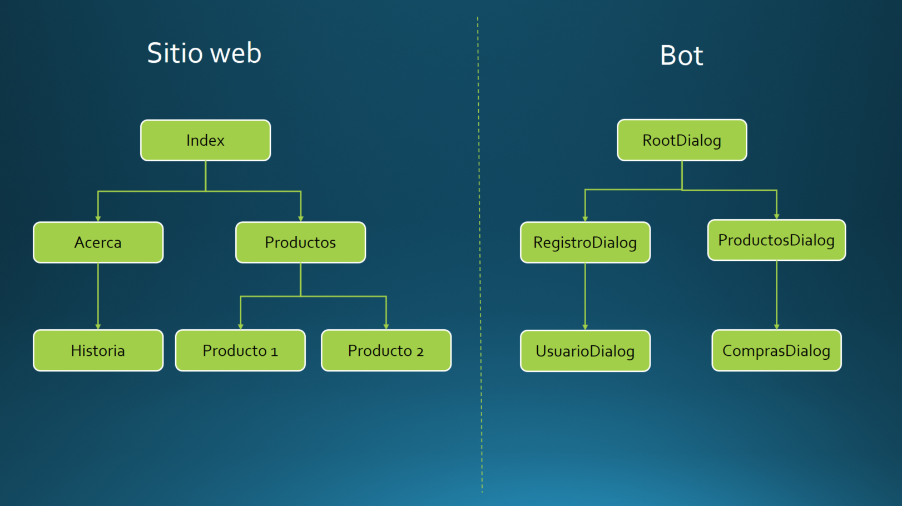

# Multiples Dialogos

En una aplicación normal o en un sitio web, todo comienza con una página principal (índex en un sitio web, Activity en una app Android). La página principal invoca a otras páginas según seleccione el usuario. Por ejemplo, una app de ventas inicia la página principal, seleccionas un producto y la a otra página donde puede hacer la compra terminando la compra vuelve a la página principal.

En un Bot, todo comienza con el RootDialog. El RotDialog invoca a otro nuevo dialogo así hasta que se cierra o invoca a otros diálogos (puede tener tantos diálogos como lo necesites).

