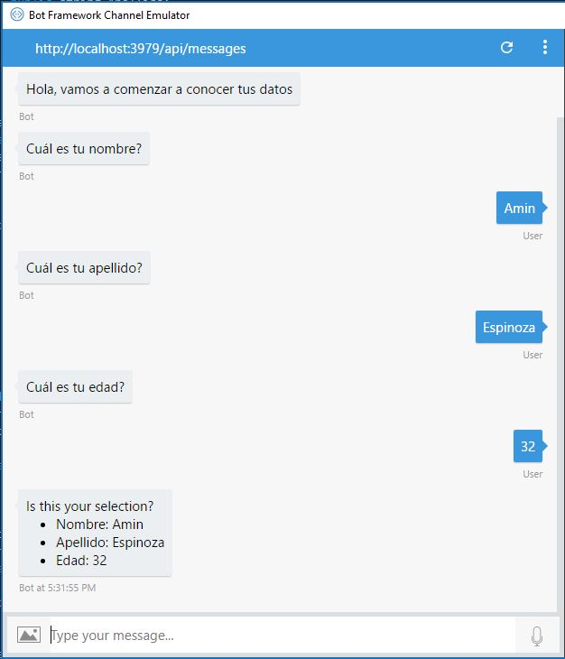
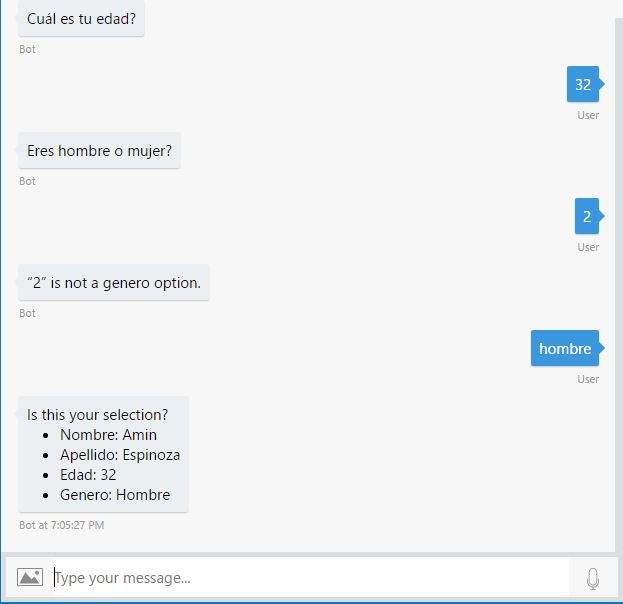

# Conceptos básicos de FormFlow

A pesar de que los diálogos son una gran herramienta solo usando un flujo continuo de mensajes es que se podrá llevar una conversación adecuada. Variables tan simples como un texto equivocado o ambiguo, volver a una pregunta anterior o cosas así complicarán cada vez más las cosas y aquí es donde entra **FormFlow**. Esta característica es la que puede simplificar muchísimo este proceso.

FormFlow tiene la capacidad de generar automáticamente los diálogos que son necesarios para llevar una conversación. Para que esto suceda debes especificar guías de flujo. Usar FormFlow puede reducir un poco la flexibilidad de lo que puedes hacer al manejar diálogos por ti mismo así que podrás decidir entre la opción de ganar mucho tiempo con FormFlow o implementarlo de manera directa y manual, como siempre la decisión será tuya y debes elegir con base a las variables de cada caso.

## Para comenzar

Para definir un flujo, lo primero que necesitas es la información a coleccionar de parte del usuario. Puedes crear un formulario creando una nueva clase que contenga una o más propiedades para representar los datos a obtener. Los valores que pueden usarse son los siguientes.

* Integral
* Punto flotante (float, double)
* Cadena (string)
* DateTime
* Enumerables
* Lista de enumerables

Comienza por crear un nuevo poryecto y en la carpeta de **Dialogs** crea una nueva clase, una vez hecho esto, haz esta clase serializable, checa en el ejemplo las únicas sentencias **using** que vas a utilizar.

``` csharp - C
using Microsoft.Bot.Builder.Dialogs;
using Microsoft.Bot.Builder.FormFlow;
using System;

namespace PreguntasRespuestasBasicas.Dialogs
{
    [Serializable]
    public class BasicForm
    {

    }
}
```

Agrega dentro de la clase tres variables basadas en la clase **Prompt**, nota como en el parámetro de la clase puedes anotar la pregunta que esperas que el bot haga por ti.
``` csharp - C
using Microsoft.Bot.Builder.Dialogs;
using Microsoft.Bot.Builder.FormFlow;
using System;

namespace PreguntasRespuestasBasicas.Dialogs
{
    [Serializable]
    public class BasicForm
    {
        [Prompt("Cuál es tu nombre?")]
        public string Nombre;

        [Prompt("Cuál es tu apellido?")]
        public string Apellido;

        [Prompt("Cuál es tu edad?")]
        public string Edad;
    }
}
```
Después de la edad seguirá el método que te permitirá invocar al formulario. Este método consta de tres partes y todas están basadas en una sintaxis muy parecida a LINQ. El método **Message** se encargará de desencadenar el primer comentario de la conversación, el método **OnCompletition** mostrará un mensaje final con todos los datos y con un mensaje indicando que todo está en orden y por último el método **Build** que ejecutará todo únicamente.
``` csharp - C
public static IForm<BasicForm> BuildForm()
{
    return new FormBuilder<BasicForm>()
        .Message("Hola, vamos a comenzar a conocer tus datos")
        .OnCompletion(async (context, BasicForm) =>
        {
            await context.PostAsync("Tu perfil está completo.");
        })
        .Build();
}
```
Ya que todo esté listo, ve a la clase **MessageController** y en esta clase invoca al formulario desde la actividad de tipo mensaje, para hacerlo, deberás invocar a un método de tipo **IDialog**
``` csharp - C
if (activity.Type == ActivityTypes.Message)
{
    await Conversation.SendAsync(activity, CrearFormulario);
}
```

El método que con esta acción estás ejecutando es el siguiente, verás que estás invocando gracias al proceso **FromForm** el método que está listo en el formulario para ser invocado.
``` csharp - C
private static IDialog<BasicForm> CrearFormulario()
{
    return Chain.From(() => FormDialog.FromForm(BasicForm.BuildForm));
}
```
Ejecuta el método, el resultado en tu bot será el siguiente.



Como puedes ver, el formulario de preguntas funciona de manera adecuada pero hay muchas cosas que puedes hacer para mejorar como por ejemplo hablar de preguntas acotadas, incluye un enumerador dentro de la clase del formulario, después, claro de la clase ya creada
``` csharp - C
using Microsoft.Bot.Builder.Dialogs;
using Microsoft.Bot.Builder.FormFlow;
using System;

namespace PreguntasRespuestasBasicas.Dialogs
{
    [Serializable]
    public class BasicForm
    {
        [Prompt("Cuál es tu nombre?")]
        public string Nombre;

        [Prompt("Cuál es tu apellido?")]
        public string Apellido;

        [Prompt("Cuál es tu edad?")]
        public string Edad;

        public static IForm<BasicForm> BuildForm()
        {
            return new FormBuilder<BasicForm>()
                .Message("Hola, vamos a comenzar a conocer tus datos")
                .OnCompletion(async (context, BasicForm) =>
                {
                    await context.PostAsync("Tu perfil está completo.");
                })
                .Build();
        }
    }

    [Serializable]
    public enum Genero
    {
        Hombre = 1,
        Mujer = 2
    };

}
```

Ya que tienes al enumerador, puedes entonces invocarlo en las variables.
``` csharp - C
public class BasicForm
    {
        [Prompt("Cuál es tu nombre?")]
        public string Nombre;

        [Prompt("Cuál es tu apellido?")]
        public string Apellido;

        [Prompt("Cuál es tu edad?")]
        public string Edad;

        [Prompt("Eres hombre o mujer?")]
        public Genero Genero;

        public static IForm<BasicForm> BuildForm()
        {
            return new FormBuilder<BasicForm>()
                .Message("Hola, vamos a comenzar a conocer tus datos")
                .OnCompletion(async (context, BasicForm) =>
                {
                    await context.PostAsync("Tu perfil está completo.");
                })
                .Build();
        }
    }
```
Ahora podrás elegir entre hombre y mujer en tu emulador y lo mejor, gracias a esto podrás delimitar las respuestas, el resultado en tu emulador será el siguiente.



Como puedes ver, si ingresas algún tipo de información en el emulador que no corresponda con los datos del enumerador que tú estás fijando el mismo bot evitará que se ingresen y volverá a repetir la pregunta. Cuando toda la información haya sido completada se desplegará un resumen con todos los detalles.


