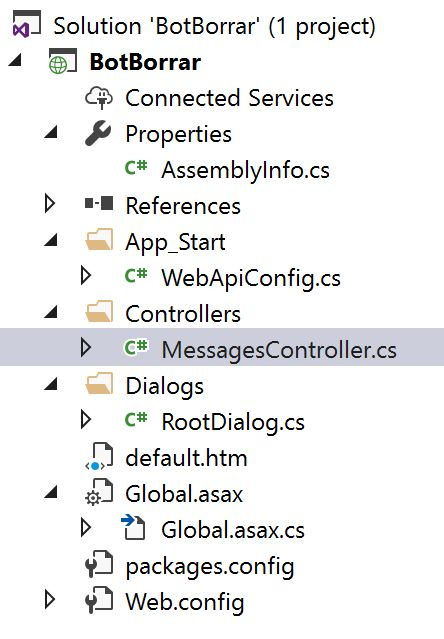

## Estructura de un proyecto de Bot.

Ya que [descargaste todas las herramientas](https://github.com/aminespinoza/Curso-bots/tree/master/Ejercicios/1.%20Requisitos%20y%20material%20necesarios) para comenzar a trabajar con la plantilla del Bot en Visual Studio crea un nuevo proyecto. El resultado es el siguiente.

Como podrás ver, la estructura es la misma que un proyecto de tipo [Web API de ASP.NET](https://docs.microsoft.com/en-us/aspnet/web-api/) por lo que es muy fácil moverte en este proyecto si ya estás familiarizado con esta herramienta, de lo contrario, podrás ver lo siguiente.

**AssemblyInfo:** Es un archivo que te permite configurar datos de la firma del ensamblado al compilar. Datos como autor, compañia, derechos de autor, irán aquí y en el ensamblado.

**WebApiConfig.cs:** El archivo que termina de decirte de qué tipo de proyecto se trata. Esta es la primera clase invocada, de hecho es con la que arranca la aplicación definiendo los parámetros de manejo de información, sus servicios y rutas.

**MessagesController.cs:** Es la clase con la que tú como desarrollador comienzas a trabajar. Aquí es donde puedes obtener la información ingresada de tu usuario y en donde la gran mayoría de ejercicios de este curso sucederán.

**RootDialog.cs:** Es la clase invocada por defecto si el usuario escribe un mensaje y desencadena cierta función, por ahora solo obtiene el mensaje y cuenta la cantidad de caracteres ingresados.

**Default.htm:** La página que se mostrará al momento de ejecutar la aplicación en tu explorador.

**Global.asax.cs:** La clase que inicia el ciclo de vida de la aplicación y solo invoca a WebApiConfig.cs.

**packages.config** Esta es fácil, solo se trata de las bibliotecas de clases agregadas al proyecto.

**Web.config** El archivo de configuración de la aplicación. Aquí será donde deberás establecer parámetros de configuración como el ID de registro y password para publicar en el Directorio de Bots.

## ¿Por qué es importante saber esto?

Es muy fácil, conocer la estructura del proyecto es indispensable para comenzar a trabajar, para saber que clases invocar y cómo funciona el ciclo de vida de la aplicación así como de cada evento. Con esto podrás comenzar a trabajar en todos los ejercicios por venir.

¡Disfuta!

[Amin Espinoza](https://twitter.com/aminespinoza)
