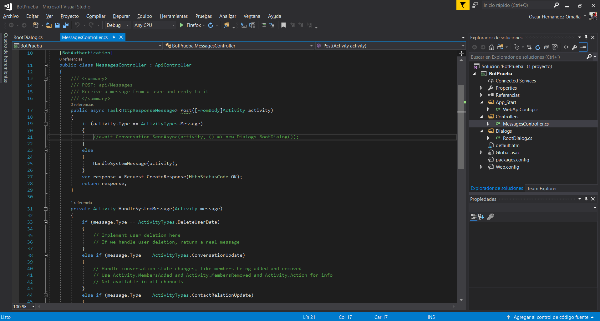

# Despliegue local de un bot y emulador

En este ejercicio verás qué necesitas hacer para desplegar tu bot a modo de prueba en tu entorno local.

## Paso 1

Crear un nuevo proyecto en Visual Studio de tipo C# y elegimos Bot Application

Con el proyecto creado no tendrás grandes complicaciones, todo reside esencialmente en MessageController.cs, de hecho viene un ejercicio simple en el que nos apoyaremos en esta ocasión para mostrar el primer ejemplo.

Solo presiona F5 y listo. Tendrás tu proyecto compilado. Simple ¿no?

## Paso 2:
Abre el emulador que ya debiste haber obtenido de tu segundo enlace y claro, instalado. Una vez abierto, necesitarás algunos datos.

La URL del bot: http ://localhost:3979/api/messages

Por ahora omite los dos campos en blanco.

Ya configurado, comienza a jugar. Escribe cualquier palabra y el bot te dirá qué escribiste y cuántos caracteres has consumido.

