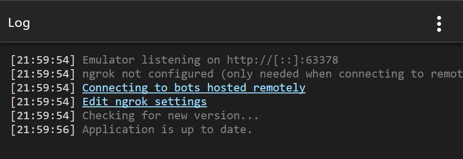
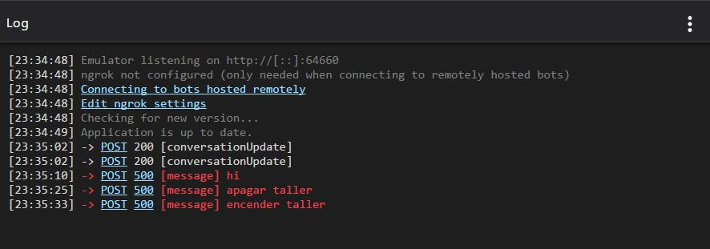

# Aprendiendo a usar el log del emulador

Quizá ahora, después de un par de ejercicios en el emulador habrás notado que en las columnas de la derecha. Hay una que tiene como título **Log**.

Únicamente abriendo tu aplicación te aparece la sugerencia de conectarte vía [ngrok]("https://ngrok.com/") a tu bot remoto. En el caso de que se trate de un despliegue local no es necesario hacerlo, para este caso Visual Studio se encarga de desplegar un mini servidor web que te facilita las cosas. Y hablando de ello, ya que hayas agregado la url del bot con el que estás trabajando, da clic sobre la palabra POST en la sección de Log para ver el detalle como aparece en la imagen.

¿Qué significa esto? Bueno, en primer lugar que la conexión al servidor web creado para este fin fue hecha con éxito. En segundo lugar puedes notar que se utiliza la misma convención de números que la definición de [códigos de estado de HTTP]("https://www.w3.org/Protocols/rfc2616/rfc2616-sec10.html") así que el bellísimo código 200 será lo que estemos esperando en todo momento. Por último, en la tabla de **Detalles** podrás ver que se despiega un JSON. Te recuerdo que **los bots hablan JSON** así que conocer lo que reciben o envían en la estructura de comunicación que se crea con JSON es importantísimo. Ahí podrás ver todos los detalles de cada transacción ya sea recibida o enviada.

## Mensajes más comunes que debes tener presentes

Es importante que con cada operación realizada le des un vistazo a tu ventana de Log pues te dará muchas buenas indicaciones de hacia donde ver si se trata de un error evitándote así el corregir por tanteo (una de las peores prácticas de programación que existen si me permites decirlo). Aquí puedes ver un par de ejemplos de lo explícitos que son.

**connect ECONNREFUSED 127.0.0.1:3979**  
Tu servidor web temporal está deshabilitado, solo ve a Visual Studio y vuelve a ejecutar tu proyecto.

**POST 500 [message]**  
Volvemos a las convenciones de los códigos de HTTP, así que sabrás que es error interno del servidor.

Lo ideal será mantener un flujo de datos como el siguiente:  

En donde podrás ver que cada operación tanto al enviar como obtener información se está registrando en esta ventana. Con esto podrás mantener un registro de cada actividad y tener un control muy bueno de cada respuesta así que dedica mucha atención a esta ventana, te hará ahorrar mucho tiempo al encontrar los posibles errores que tu aplicación pueda tener. 

