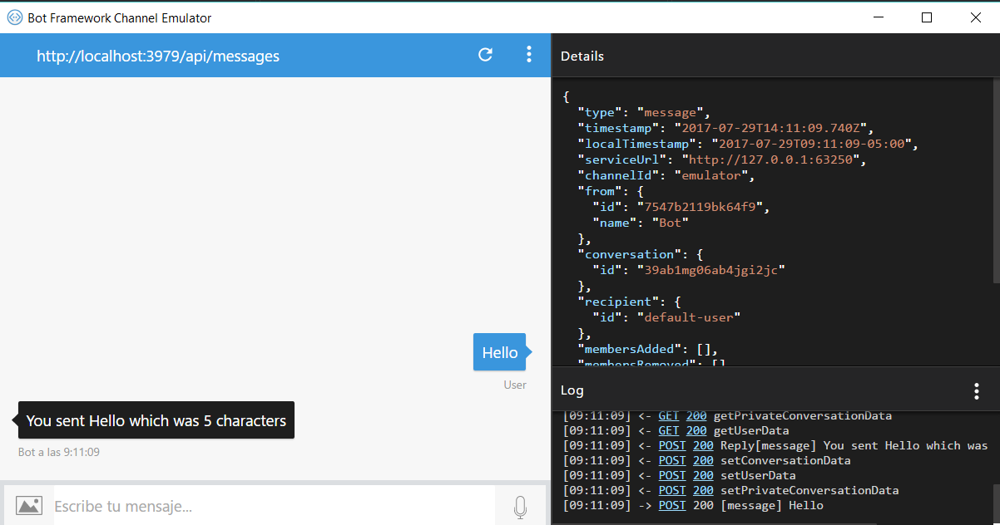

# Despliegue local de un bot y emulador

## Paso 1:
Ya que tengas descargado del primer enlace el archivo .zip llamado Bot Framework lo debes colocar en las plantillas de C# para desarrollo, esto es: ..\Documents\Visual Studio 2015\Templates\ProjectTemplates\Visual C#

Ya en la posición adecuada, al abrir Visual Studio podrás ver la plantilla de proyecto disponible para crear el primero de este tipo.

Con el proyecto creado no tendrás grandes complicaciones, todo reside esencialmente en MessageController.cs, de hecho viene un ejercicio simple en el que nos apoyaremos en esta ocasión para mostrar el primer ejemplo.

Solo presiona F5 y listo. Tendrás tu proyecto compilado. Simple ¿no?

## Paso 2:
Abre el emulador que ya debiste haber obtenido de tu segundo enlace y claro, instalado. Una vez abierto, necesitarás algunos datos.

La URL del bot: http ://localhost:3979/api/messages

Por ahora omite los dos campos en blanco.

Ya configurado, comienza a jugar. Escribe cualquier palabra y el bot te dirá qué escribiste y cuántos caracteres has consumido.

