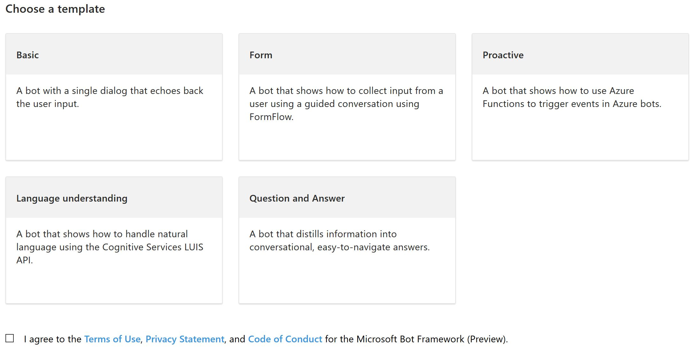
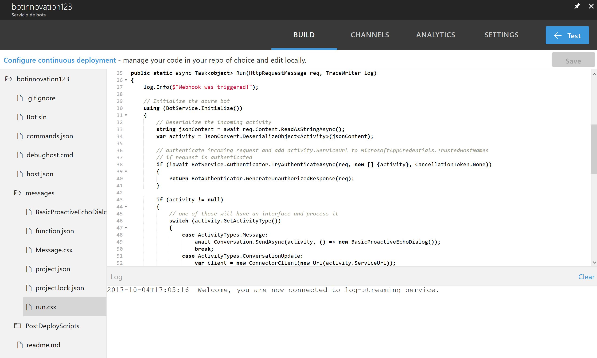

# Plantillas de Azure Bot Service

Con Azure Bot Services ya viste en el artículo pasado como trabajar de manera eficiente al crear un bot casi de manera inmediata y pública pero es momento de detenernos un poco en la creación de las plantillas que vienen por defecto en este servicio. Naturalmente veremos solo un par debido a que por su complejidad las demás las abarcaremos en temas posteriores.

Las cinco opciones son las siguientes:  

* Basic
* Form
* Proactive
* Language understanding
* Question and answer

Desglocemos por partes para ver cada una de las plantillas ¿Te parece bien?

## Basic

Nada más que el formulario más sencillo, es muy fácil de desplegar y comenzar a trabajar aquí, de hecho es el mejor ejemplo de como iniciar un proyecto, basicamente es lo mismo que en un proyecto en blanco de Bot Framework. Envias un mensaje y lo devuelve únicamente, nada más. Si piensas crear un bot con esta plantilla puedes ver más información [aquí](https://docs.microsoft.com/en-us/bot-framework/azure-bot-service-serverless-template-basic).

## Form

Un pequeño formulario basado en FormFlow, esto es tan necesario que lo veas que dedicaremos un artículo para ello, de hecho, la base es el artículo que sigue a este para comenzar a platicar acerca de como llevar el flujo de una conversación. Si piensas crear un bot con esta plantilla puedes ver más información [aquí](https://docs.microsoft.com/en-us/bot-framework/azure-bot-service-serverless-template-form).

## Proactive

Este es uno de los dolores de cabeza más comunes al tratar de trabajar con un bot. Hacerlo proactivo es una tarea complicada, no compleja, es decir, solo basta que agregues un desencadenador que ejecute la acción de conversación del bot. En el caso de esta plantilla, utilizas una [Azure Function](https://azure.microsoft.com/es-mx/services/functions/) que funcione a modo de desencadenador para iniciar la conversación. Si piensas crear un bot con esta plantilla puedes ver más información [aquí](https://docs.microsoft.com/en-us/bot-framework/azure-bot-service-template-proactive).

## Language understanding

Definitivamente la mejor de todas las plantillas. Esta plantilla implementa los servicios de [LUIS](https://azure.microsoft.com/es-mx/services/cognitive-services/language-understanding-intelligent-service/), esto permite al usuario por medio de intentos ingresar la información que LUIS tendría la capcacidad de entender y actuar con base al comentario ingresado. Si piensas crear un bot con esta plantilla puedes ver más información [aquí](https://docs.microsoft.com/en-us/bot-framework/azure-bot-service-template-language-understanding).

## Question and answer

Esta plantilla creará un bot que use una base de conocimiento establecido para contestar preguntas del usuario. Este despliegue de elementos basados en preguntas y respuestas puede o no llevar al control de un humano o simplemente terminar la conversación. Si piensas crear un bot con esta plantilla puedes ver más información [aquí](hhttps://docs.microsoft.com/es-mx/bot-framework/azure-bot-service-template-question-answer).

En cualquiera de los casos, al seleccionar una plantilla podrás encontrar diferentes archivos de acuerdo a tu selección. Yo escogí para este ejemplo la plantilla de bot proactivo para poder continuar con este ejemplo, la estructura del proyecto luce así.

Puedes ver cosas importantes como que hay un archivo llamado **Bot.sln** lo que significa que podrás descargar la plantilla y trabajar desde Visual Studio, de hecho, esta es la función más atractiva de trabajar con el Bot Service, hay un apartado de integración y despliegue continuo sumamente interesante aquí. No lo consideraremos dentro de los temas pues por ser más DevOps que Bot Framework, pero seguro a estas alturas ya debes estar intrigado así que puedes ver este [enlace](http://dailydotnettips.com/2017/07/18/setting-up-continuous-integration-for-azure-bot-services/) para poder leer mucho más al respecto, esa es muy buena idea.

Otra de las cosas que puedes ver es la extensión **.csx**, el archivo run cuenta con ella y es prácticamente donde tienes todo el código funcional de la aplicación. Si creas diferentes plantillas podrás notar que el código desplegado aquí es muy diferente y esto te dará una buena guía de cómo comenzar a trabajar con cada una de las tareas que cada bot puede hacer.

Ve al archivo BasicProactiveEchoDialog.csx y verás la parte de cómo trabajar con un bot proactivo.

Podrás ver a grandes resgos que el bot es capaz de apoyarse en una función, crear una cola de mensajes y después enviar el mensaje adecuado para que tu usuario lo reciba. Volvemos a lo mismo, este tema lo abordaremos de manera mucho más profunda, pero aquí puedes tener un buen previo de lo que haremos entonces.

Una gran ventaja de trabajar con este tipo de servicio en lugar del Bot Framework es que puedes sentirte muy cómodo si ya tienes ventaja trabajando con Azure Functions debido a la enorme similitud de lo que ambas plantillas tienen.

