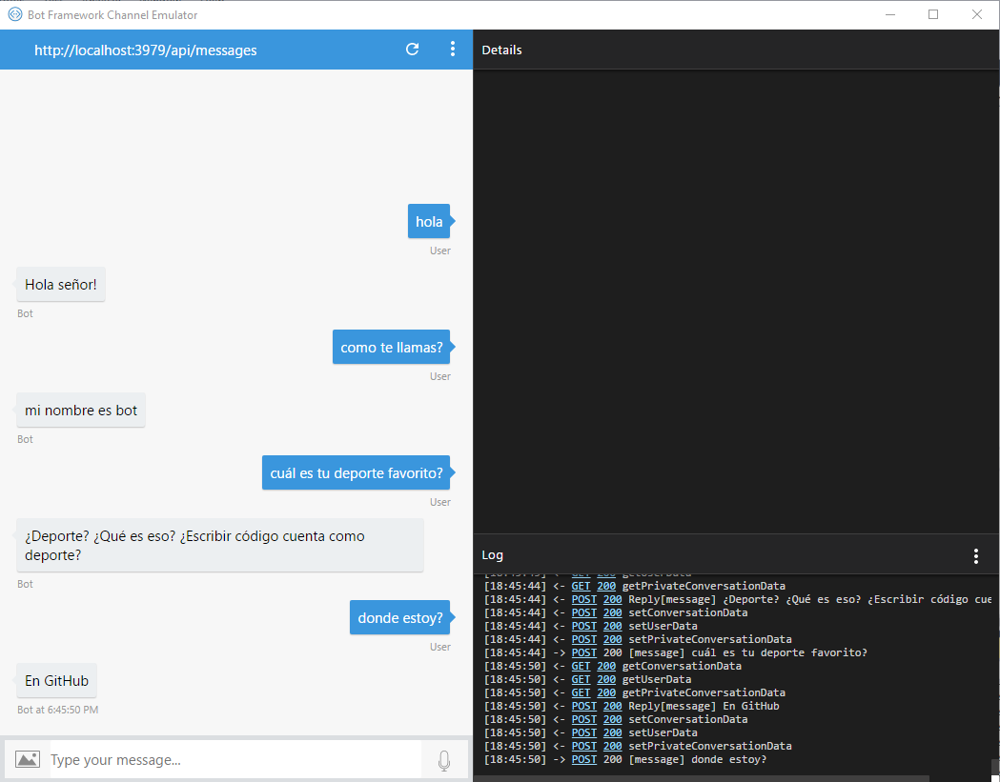

# Preguntas y respuesta básicas del Bot

Preguntas y respuestas básicas con el Bot

Antes de hacer a nuestro bot super inteligente podemos comenzar a enseñarle algunas respuestas básicas esto de hecho es muy simple, solo necesitaremos usar un switch para que sean también preguntas ya definidas. Por ejemplo: ¿cómo te llamas?  ¿cuál es tu deporte favorito? Etc..
Así que sin más vamos directo al código…
Creamos un nuevo proyecto de Bot en Visual Studio 
Agregaremos un switch en nuestra clase RootDialog dentro del método MessageReceivedAsync

Ahí dejaremos comentadas estas líneas 

```csharp - C

            // calculate something for us to return
            //int length = (activity.Text ?? string.Empty).Length;

            // return our reply to the user
            //await context.PostAsync($"You sent {activity.Text} which was {length} characters");
```
Y en su lugar pondremos nuestro switch 


``` csharp - C
            switch (message)
            {
                case "hola":
                    await context.PostAsync("Hola señor!");
                    break;
                case "como te llamas?":
                    await context.PostAsync("mi nombre es bot");
                    break;
                case "cuál es tu deporte favorito?":
                    await context.PostAsync("¿Deporte? ¿Qué es eso? ¿Escribir código cuenta como deporte?");
                    break;
                case "donde estoy?":
                    await context.PostAsync("En GitHub");
                    break;
                default:
                    await context.PostAsync("Lo siento, no entendí esto");
                    break;
            }
```


Y pondremos esta línea antes del switch para que pueda entrar...

``` csharp - C
string message = activity.Text.ToLower();
```

es importante mencionar que él .Tolower nos servirá para que pueda reconocer entre mayúsculas y minúsculas.

Con esto listo el resultado que obtendremos será algo así.

