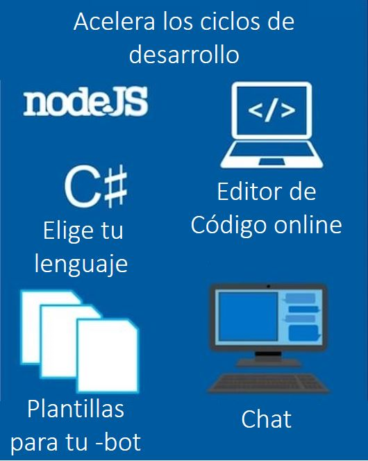
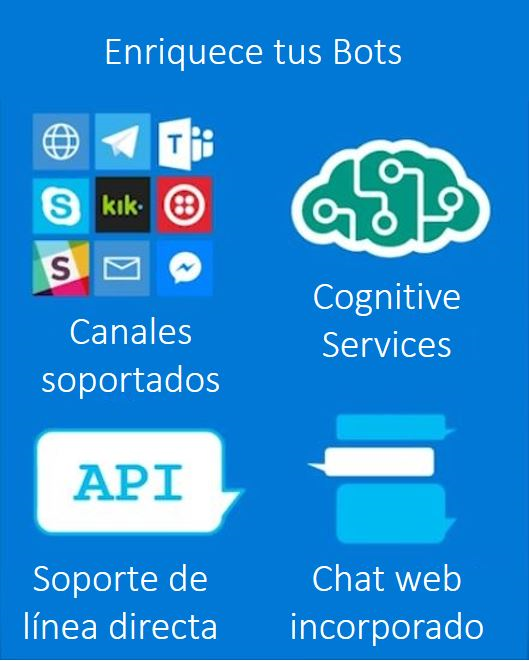
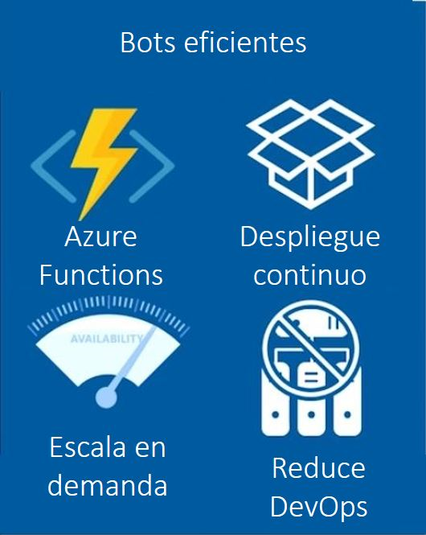
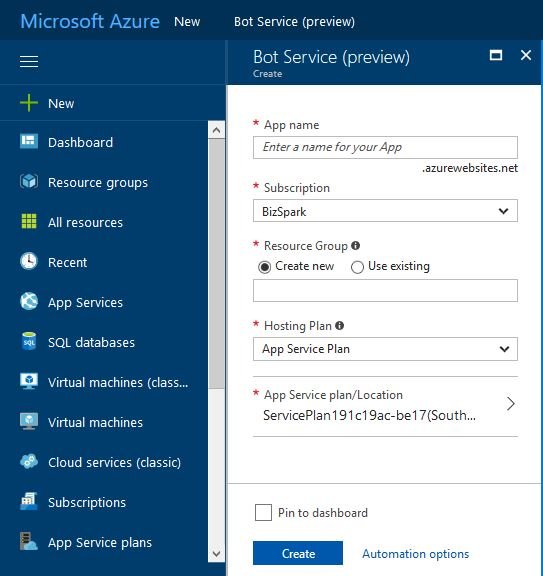
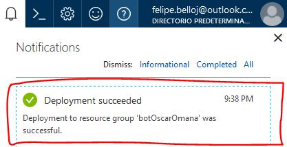
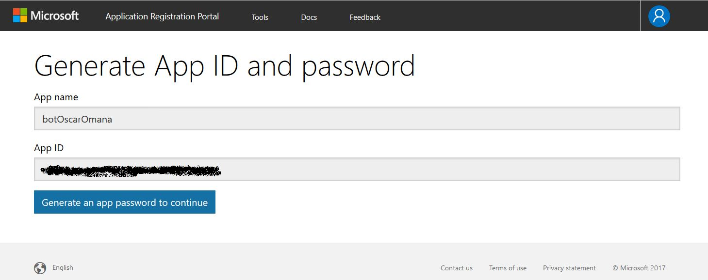
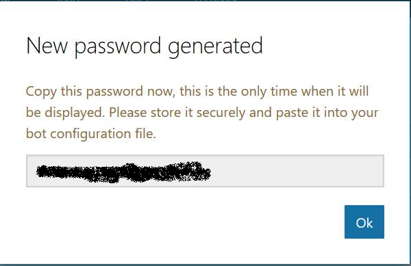

# Azure Bot Service

Con Azure Bot Services Podemos acelerar los ciclos de desarrollo de nuestro Bot con solo un clic y una pequeña configuración, podemos elegir nuestro lenguaje de preferencia ya sea Nodejs o C# y elegir una de las 5 plantillas preinstaladas y menos de 3 minutos podremos comenzar un chat con nuestro Bot y también cambiar el código con el editor de código online incorporado.

Puedes utilizar herramientas para enriquecer y hacer más atractivos tus Bots como por ejemplo utilizar Cognitive Service y además conectarlo con canales externos como: Skype, kik, slack, email, facebook, Messenger, maxell teams etc.

Y finalmente puedes hacer tu Bot más eficiente con ayuda de Azure functions con un despliegue continuo, puede ser escalable bajo demanda y muchas ventajas más. 

ahora solo resta crear nuestro Bot con ayuda de Azure Bot Service. 

## Requisitos

Es necesario contar con una suscripción a Microsoft Azure, si no cuentas con una no te preocupes, puedes usar una de prueba por 15 días la podrás activar directo en este [enlace](https://azure.microsoft.com/en-us/free/)

## Crea tu bot 

Lo primero es iniciar sesión en tu cuenta de Azure, luego de eso en el menu seleccionamos: 
1.	Nuevo 
2.	Data + Analytics 
3.	Bot Service 

Te saldrá una ventana como esta donde deberás llenar la información que se te pide 

•	App name (el nombre de tu Bot)

•	Subscription 

•	Resource Group etc..

Y por último damos clic en el botón de crear tomara unos minutos en lo que se despliega el servicio

cuando esté listo en la parte superior derecha vas a encontrar el icono de las notificaciones en forma de campana y ahí encontraras si todo salió bien la leyenda "Deployment succeeded"

Cuando esté listo nos mostrara una pantalla como la siguiente (primera imagen) donde deberemos dar clic para generar nuestro App e ID, estos los genera automáticamente (segunda imagen) y por último damos clic en generar app password

Aquí es muy importante que copies ese password ya que será la única vez que lo mostrara, si no lo haces deberás hacer de nuevo todo el proceso anterior.

Das clic en finalizar y regresar al Bot Framework 

Ya en la ventana que de regresa vas a pegar ese password en el paso donde te lo indica 

