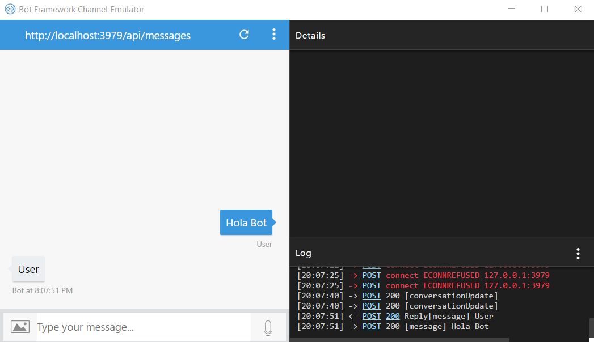

# Obtener el id de mi usuario.

Algunas veces necesitaremos obtener el id de nuestro usuario, puede ser que sea solo para que nos salude por nuestro nombre o para muchas otras funciones más.

Para este ejemplo usaremos el ejercicio anterior que lo puedes ver en este [enlace](https://github.com/aminespinoza/Curso-bots/tree/master/Ejercicios/9.%20Preguntas%20y%20respuestas%20b%C3%A1sicas)

Bien para obtener el id de nuestro usuario solo basta con modificar un poco nuestra clase MessagesControlle en el método public async Task<HttpResponseMessage> Post([FromBody]Activity activity)


Lo que necesitaremos es agregar un par de líneas 

``` csharp - C
if(activity.From.Name != null)
string userName= activity.From.Name;
``` 

esto será antes de nuestro await

justo de esta forma…

``` csharp - C
if (activity.Type == ActivityTypes.Message)
            {
                string userName = "";
                if (activity.From.Name != null)
                    userName = activity.From.Name;//Here we are getting user name
                await Conversation.SendAsync(activity, () => new Dialogs.RootDialog());
            }
            else
            {
                HandleSystemMessage(activity);
            }
            var response = Request.CreateResponse(HttpStatusCode.OK);
            return response;
``` 

por ahora, como estamos en el emulador el usuario que nos devolverá será el default “user” 

por lo tanto, el resultado será el siguiente…


