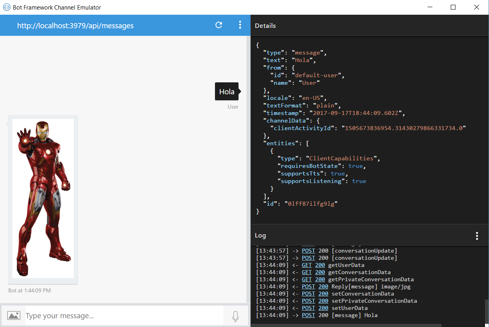

# ¿Qué es un mensaje?

¡Hola! Hasta ahora hemos hablado de Bots y los mensajes que regresa, pero…

## ¿Qué es un mensaje?

Bien vamos a definir a un mensaje como el tipo de actividad más común.

Un mensaje poder ser tan simple como una cadena de texto o contener archivos adjuntos, elementos interactivos y tarjetas enriquecidas. Por ejemplo, añadir un bot a la lista de contactos del usuario podría provocar que el bot responda con un mensaje que contenga una cadena que diga "¡Gracias!" y una imagen de una cara feliz.

