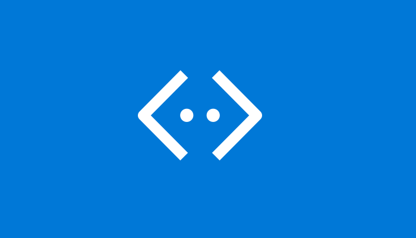
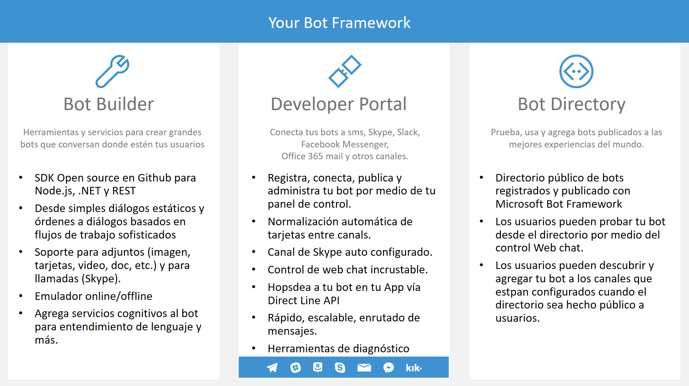
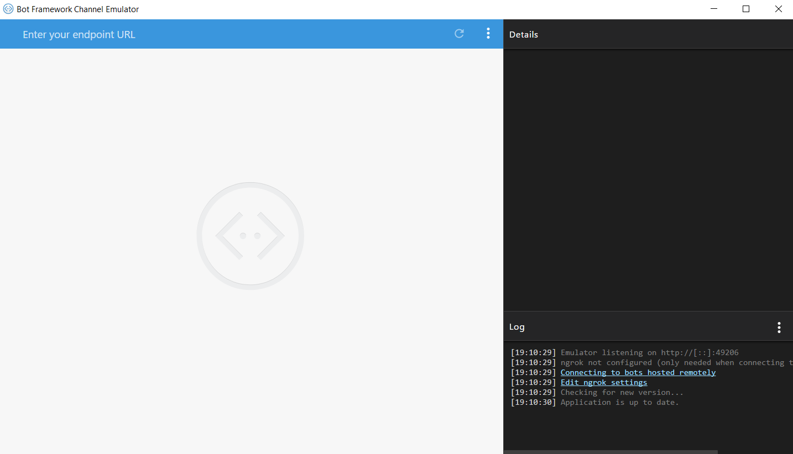

# Requisitos y material necesarios

## ¿Qué es un bot?

Piense en un bot como una aplicación con la que los usuarios interactúan de una manera conversacional. Los bots pueden comunicarse con texto, tarjetas o voz. Un bot puede ser tan simple como el patrón básico que empareja con una respuesta, o puede ser un sofisticado tejido de técnicas de inteligencia artificial con el estado conversacional complejo de seguimiento e integración a los servicios empresariales existentes.

El Bot Framework le permite crear bots que soporten diferentes tipos de interacciones con los usuarios.

La conversación puede utilizar cadenas de texto simples o tarjetas complejas más complejas que contienen texto, imágenes y botones de acción. Y puede añadir interacciones de lenguaje natural, que permiten a sus usuarios interactuar con sus robots de una manera natural y expresiva.

Los robots se están convirtiendo rápidamente en una parte integral de las experiencias digitales. Se están volviendo tan esenciales como un sitio web o una experiencia móvil para que los usuarios interactúen con un servicio o aplicación.

## Bot Framework 

Para construir nuestros propios Bots se presentó el Bot Framework que, actualmente, consta de un conjunto de servicios más un SDK con los que podremos desarrollar nuestro Bot de forma sencilla:

## Requisitos y material necesarios

### Visual Studio:
 debes tener instalado visual estudio 2017 en un equipo, no importa si es el Community, Professional o Enterprise. Puedes obtenerlo en este [enlace.](https://www.visualstudio.com/es/downloads/?rr=https%3A%2F%2Fwww.google.com.mx%2F) 

### Bot Template: 
Template para Visual Studio que nos facilita el empezar un nuevo proyecto ya que tiene todas las referencias necesarias configuradas. Podemos descargarlo desde la siguiente [enlace.](http://aka.ms/bf-bc-vstemplate)

Una vez descargado, copiamos el template a la carpeta correspondiente (%USERPROFILE%\Documents\Visual Studio 2017\Templates\ProjectTemplates\Visual C#), para tenerlo disponible desde Visual Studio.

### Bot Emulator: 
Que nos instala una especie de ventana de chat donde podemos probar el correcto funcionamiento de nuestro Bot, descargalo en este [enlace.](https://github.com/Microsoft/BotFramework-Emulator/releases/download/v3.5.31/botframework-emulator-Setup-3.5.31.exe)

Hasta aquí estás listo para continuar con los siguientes temas.