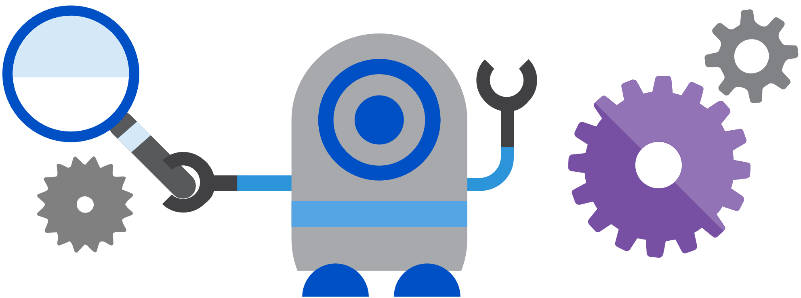

# Consideraciones antes de crear un bot

## Principios del diseño del bot

El Bot Framework permite a los desarrolladores crear atractivas experiencias de bot que resuelven una variedad de problemas empresariales.
En este tema prenderas lo que se necesita para diseñar un bot que se alinea con las mejores prácticas para desarrollar un bot.

### Diseñar un bot

Si te encuentras construyendo un bot, es seguro asumir que esperas que los usuarios lo utilicen. También es seguro asumir que esperas que los usuarios prefieran la experiencia de bot sobre experiencias alternativas como aplicaciones, sitios web, llamadas telefónicas y otros medios para abordar sus necesidades particulares. En otras palabras, tu bot está compitiendo por el tiempo de los usuarios frente a cosas como aplicaciones y sitios web. Entonces, ¿cómo se puede maximizar las probabilidades de que su bot logrará su objetivo final de atraer y mantener a los usuarios? Es simplemente una cuestión de priorizar los factores adecuados al diseñar tu bot.

### Factores que no garantizan el éxito de un bot

Al diseñar su bot, ten en cuenta que ninguno de los siguientes factores garantiza necesariamente el éxito de un robot:

    Cómo es "inteligente" el bot: En la mayoría de los casos, es poco probable que hacer tu bot más inteligente garantizará a los usuarios felices y la adopción de su plataforma. En realidad, muchos bots tienen poco aprendizaje avanzado de máquinas o capacidades de lenguaje natural. Por supuesto, un bot puede incluir esas capacidades si son necesarias para resolver los problemas que está diseñado para abordar. Sin embargo, no debe asumir ninguna correlación entre la inteligencia de un bot y la adopción por el usuario del bot.

    Cuánto lenguaje natural soporta el bot: Tu bot puede ser genial en las conversaciones. Puede tener un vasto vocabulario e incluso puede hacer grandes bromas. Pero a menos que se trate de los problemas que sus usuarios necesitan para resolver, estas capacidades pueden contribuir muy poco a hacer tu bot exitoso. De hecho, algunos bots no tienen ninguna capacidad de conversación en absoluto. Y en muchos casos, está perfectamente bien.

    Voz: No siempre es el caso que la habilitación de bots para el habla conduzca a grandes experiencias de usuario. A menudo, forzar a los usuarios a usar la voz puede resultar en una experiencia frustrante para el usuario. Al diseñar tu bot, considera siempre si la voz es el canal apropiado para el problema dado. ¿Va a haber un ambiente ruidoso? ¿Transmitirá la voz la información que debe ser compartida con el usuario?

### Factores que influyen en el éxito de un bot

La mayoría de las aplicaciones o sitios web exitosos tienen al menos una cosa en común: una gran experiencia de usuario. Los bots no son diferentes a este respecto. Por lo tanto, garantizar una gran experiencia de usuario debe ser tu prioridad número uno al diseñar un bot. Algunas consideraciones clave incluyen:

    ¿El bot resuelve fácilmente el problema del usuario con el número mínimo de pasos?

    ¿El bot resuelve el problema del usuario mejor / más fácil / más rápido que cualquiera de las experiencias alternativas?

    ¿Funciona el bot en los dispositivos y plataformas que el usuario se preocupa?

    ¿El bot es detectable? ¿Los usuarios saben naturalmente qué hacer al usarlo?

Ten en cuenta que ninguna de estas preguntas se relaciona directamente con factores tales como la inteligencia que tiene el bot, la cantidad de capacidad de lenguaje natural que tiene, si se utiliza la máquina de aprendizaje o que lenguaje de programación se utilizó para crearlo. Es poco probable que los usuarios se preocupan por cualquiera de estas cosas si el bot resuelve el problema que necesitan abordar y ofrece una gran experiencia de usuario. Una gran experiencia de usuario de bot no requiere que los usuarios escriban demasiado, hablan demasiado, se repiten varias veces o explican cosas que el bot debe conocer automáticamente.

El proceso de diseño de un bot es como el proceso de diseño de una aplicación o sitio web, por lo que las lecciones aprendidas de décadas de construcción de la interfaz de usuario y la entrega de UX para aplicaciones y sitios web todavía se aplican cuando se trata de diseñar los bots.
